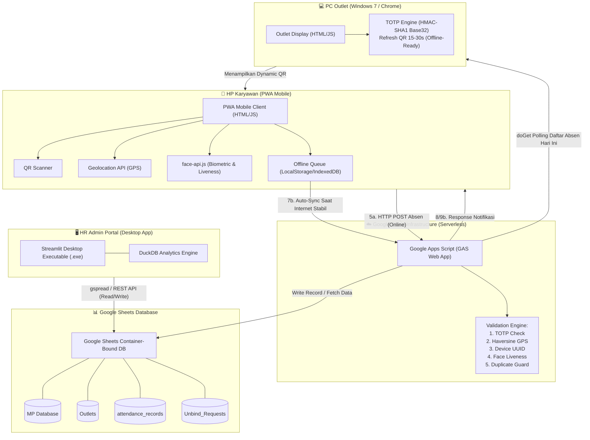
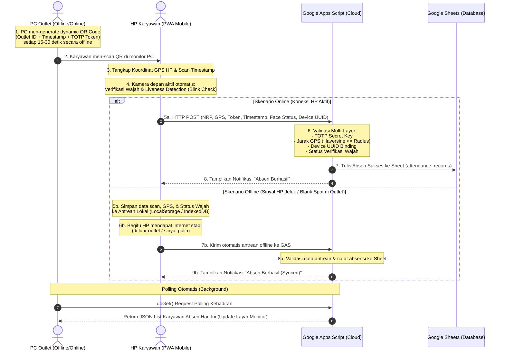

# 🏛️ Arsitektur Sistem & Alur Kerja Terbarui (Updated System Architecture & Workflow)

**Serverless Smart Attendance System** v1.0  
*Sistem Absensi Cerdas Berbasis Dynamic TOTP QR, Biometric Face Verification, Geofencing GPS, dan Sync Offline-Ready.*

---

## 📌 1. Ikhtisar Arsitektur Sistem

Sistem ini dirancang menggunakan paradigma **Serverless & Edge-Distributed Client Architecture** tanpa memerlukan server backend berbayar mandiri (*Zero Infrastructure Cost*). Google Apps Script (GAS) difungsikan sebagai API Endpoint gratis (Web App) yang terhubung langsung secara *container-bound* dengan Google Sheets sebagai basis data utama.



---

## 🔄 2. Diagram Alur Kerja (Sequence Diagram)

Berikut adalah diagram sekuens alur kerja komprehensif yang mencakup skenario koneksi **Online** dan **Offline**:



---

## 🧩 3. Rincian Komponen Utama Sistem

### 💻 A. PC Outlet Display (Monitor Cabang)
* **File Utama:** [outlet_display.html](file:///c:/attendance_system_v1/outlet_display.html), [qrcode.min.js](file:///c:/attendance_system_v1/qrcode.min.js)
* **Fungsi & Keunggulan:**
  1. **100% Offline QR Generation:** Menggunakan pustaka ringan JavaScript untuk meng-generate QR Code dinamis berbasis waktu (TOTP HMAC-SHA1 Base32) tanpa memerlukan koneksi internet stabil.
  2. **Dukungan Perangkat Legasi:** Dirancang dan diuji sepenuhnya kompatibel dengan **Windows 7** dan peramban Google Chrome versi lama.
  3. **Live Attendance Board:** Melakukan polling `doGet()` berkala ke GAS untuk menampilkan daftar karyawan yang telah berhasil absen hari ini secara real-time di layar monitor.

### 📱 B. Mobile Employee PWA (Aplikasi HP Karyawan)
* **File Utama:** [index.html](file:///c:/attendance_system_v1/index.html), [pwa_app.js](file:///c:/attendance_system_v1/pwa_app.js), [sw.js](file:///c:/attendance_system_v1/sw.js)
* **Fungsi & Keunggulan:**
  1. **Zero App Store Installation:** Akses cepat via Progressive Web App (PWA) hosted di GitHub Pages (HTTPS).
  2. **Biometric Face Verification & Liveness Detection:** Menggunakan `face-api.js` (TensorFlow.js core) untuk mendeteksi landmark wajah dan Eye Aspect Ratio (EAR) untuk memverifikasi kedipan mata manusia asli sebelum absen diizinkan.
  3. **Geofencing GPS Integrasi:** Mengambil lokasi koordinat pengguna dari HTML5 Geolocation API.
  4. **Offline Storage & Auto-Sync Engine:** Menyimpan data absensi terenkripsi lokal di IndexedDB/LocalStorage jika tidak ada internet, dan secara otomatis mengirimkannya (*background retry*) ketika koneksi seluler kembali aktif.

### ☁️ C. Google Apps Script Backend (Serverless API)
* **File Utama:** [google_apps_script.js](file:///c:/attendance_system_v1/google_apps_script.js)
* **Fungsi & Keunggulan:**
  1. **Zero Server Maintenance Fee:** Berjalan pada infrastruktur serverless Google Apps Script dengan biaya operasional Rp 0.
  2. **Multi-Layer Validation Pipeline:** Memvalidasi TOTP Token, koordinat GPS (Haversine formula), Device UUID, dan pencegahan *double clock-in*.
  3. **Web App Endpoint:** `doPost(e)` untuk penulisan transaksi dan `doGet(e)` untuk pembacaan data polling.

### 📊 D. Google Sheets Database (Container-Bound Data Store)
* **Tab Utama:**
  1. **`MP Database`**: Data Master Karyawan (NRP, Nama, Device UUID Terdaftar).
  2. **`Outlets`**: Data Master Outlet (Outlet ID, Nama, Lat, Long, Radius M, Secret Key Base32).
  3. **`attendance_records`**: Log Transaksi Absensi (Timestamp, NRP, Nama, Outlet, Dist (m), Status Sync [Online/Offline], Device UUID).
  4. **`Unbind_Requests`**: Pengajuan Reset Device ID dari Karyawan.

### 🖥️ E. HR Admin Portal Application (Desktop Portal)
* **File Utama:** [main.py](file:///c:/attendance_system_v1/attendance_system_admin_v1/main.py) -> `HR Admin Portal.exe`
* **Fungsi & Keunggulan:**
  1. **Desktop Executable Standalone:** Aplikasi Windows berbasis Python + Streamlit yang dikompilasi dengan PyInstaller.
  2. **Workflow Unbind HP:** Persetujuan / penolakan reset ID perangkat ketika karyawan mengganti HP baru.
  3. **Analytics & Reporting:** Pengolahan data cepat menggunakan DuckDB & Pandas, serta visualisasi chart kehadiran interaktif dengan Plotly.

---

## 🛡️ 4. Pipa Keamanan 5 Lapisan (Multi-Layer Security Pipeline)

Setiap pengiriman transaksi absensi wajib lolos dari 5 pengujian keamanan berikut:

```
[ Input Payload Absensi ]
           │
           ▼
┌─────────────────────────┐
│ Layer 1: TOTP Check     │ ➔ Validasi Token QR vs Server Timestamp & Secret Key
└──────────┬──────────────┘
           │ (Valid)
           ▼
┌─────────────────────────┐
│ Layer 2: Face Liveness  │ ➔ Verifikasi deteksi kedipan mata & kontur wajah asli
└──────────┬──────────────┘
           │ (Valid)
           ▼
┌─────────────────────────┐
│ Layer 3: GPS Geofence   │ ➔ Hitung jarak Haversine (Koordinat HP vs Outlet <= Radius)
└──────────┬──────────────┘
           │ (Valid)
           ▼
┌─────────────────────────┐
│ Layer 4: Device Lock    │ ➔ Cocokkan Device UUID HP vs UUID terdaftar di MP Database
└──────────┬──────────────┘
           │ (Valid)
           ▼
┌─────────────────────────┐
│ Layer 5: Duplicate Guard│ ➔ Cek apakah NRP sudah melakukan clock-in di sesi yang sama
└──────────┬──────────────┘
           │ (Valid)
           ▼
[ Write to Google Sheets ]
```

---

## ⚡ 5. Perbandingan Skenario Online vs Offline Sync

| Parameter | Skenario Online (Koneksi HP Aktif) | Skenario Offline (Sinyal Jelek di Outlet) |
| :--- | :--- | :--- |
| **Generasi QR Code** | Ter-generate offline di PC (setiap 15-30s) | Ter-generate offline di PC (setiap 15-30s) |
| **Scan & Verifikasi HP** | Scan + GPS + Face Liveness aktif | Scan + GPS + Face Liveness aktif |
| **Penyimpanan Sementara** | Memori HP (Transient Payload) | **Local Storage / IndexedDB HP** |
| **Waktu Pengiriman** | Langsung (*Real-time*) via HTTP POST | Ditunda hingga HP berada di area sinyal stabil |
| **Validasi Backend** | Eksekusi langsung oleh GAS | Eksekusi saat antrean terkirim ke GAS |
| **Status Catatan Sheet** | Status: `ONLINE` | Status: `OFFLINE_SYNC` |

---

*Dokumen ini disusun sebagai acuan resmi Arsitektur & Alur Kerja Terbarui untuk Sistem Absensi Smart Serverless.*
